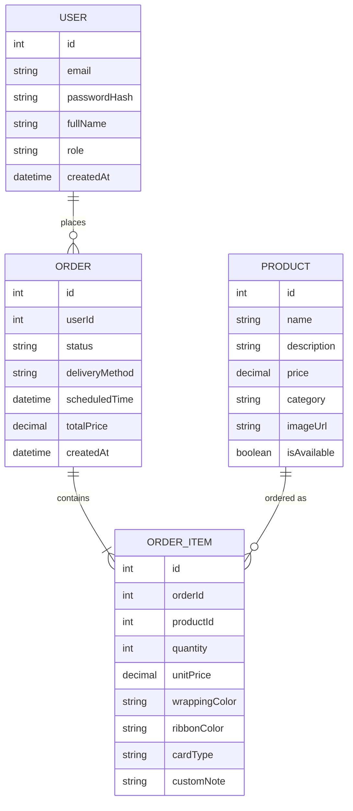

# Entity relationship model

```mermaid
erDiagram
  USER ||--o{ ORDER : places
  ORDER ||--|{ ORDER_ITEM : contains
  PRODUCT ||--o{ ORDER_ITEM : "ordered as"
  USER { int id string email string passwordHash string fullName string role datetime createdAt }
  PRODUCT { int id string name string description decimal price string category string imageUrl boolean isAvailable }
  ORDER { int id int userId string status string deliveryMethod datetime scheduledTime decimal totalPrice datetime createdAt }
  ORDER_ITEM { int id int orderId int productId int quantity decimal unitPrice string wrappingColor string ribbonColor string cardType string customNote }
```

Roles: CUSTOMER, ADMIN. Order status: PENDING, PREPARING, READY, COMPLETED (and CANCELLED, set by the daily cron job). Delivery method: DELIVERY, PICKUP.
